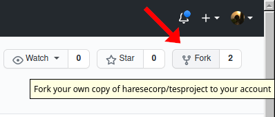
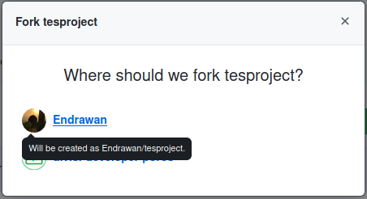
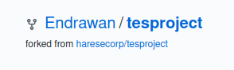
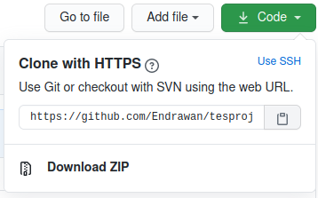
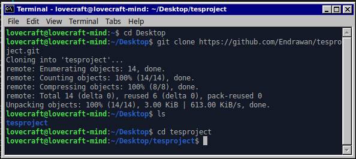
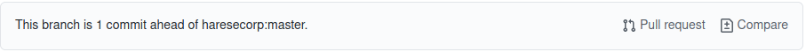
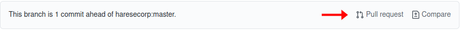
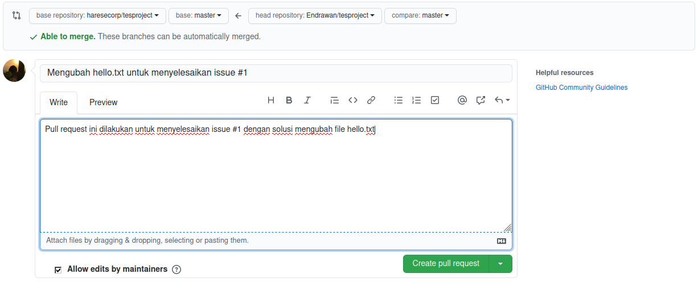

# Tata cara kontribusi
Seluruh panduan, tata cara, dan aturan untuk melakukan kontribusi dicakup pada file ini.

## Konten
- [Tata cara kontribusi](#tata-cara-kontribusi)
  - [Konten](#konten)
  - [Cara berkontribusi](#cara-berkontribusi)
    - [Menyimpan repo ke local machine](#menyimpan-repo-ke-local-machine)
    - [Menyimpan hasil progress dan mengupdate local repo dari repo utama/upstream](#menyimpan-hasil-progress-dan-mengupdate-local-repo-dari-repo-utama/upstream)
    - [Melakukan pull request](#melakukan-pull-request)
  - [Format pengerjaan](#format-pengerjaan)
    - [Struktur direktori proyek](#struktur-direktori-proyek)
    - [Teknologi yang digunakan](#teknologi-yang-digunakan)
    

## Cara berkontribusi
### Menyimpan repo ke local machine
Untuk mulai berkontribusi, pastikan kamu menginstall go terlebih dahulu pada komputer anda. Setelah itu kamu bisa mengikuti langkah-langkah dibawah.
1. Mulai dengan *fork* repo utama/upstream ini ke Akun Githubmu. Dengan mengklik tombol fork pada ujung kiri atas.<br/>


2. Pilih Akun Github kamu sebagai tujuan fork.<br/>


3. Jika fork berhasil, maka akan terbuat repo baru dengan nama akunmu seperti gambar di bawah. Inilah yang disebut fork repo.<br/>


4. Langkah selanjutnya yaitu klik tombol Code kemudian *copy* alamat fork repomu.<br/>


5. Pilih direktori/folder yang akan digunakan sebagai tempat development code, kemudian clone remote repomu ke local repo dengan command seperti dibawah
```
$ git clone <alamat-remote-git-mu.git>
```


6. Setelah fork repo berhasil diclone, langkah selanjutnya yaitu menambah remote upstream ke local projek/repo. Tujuannya adalah agar local repo mu tetap terupdate dengan upstream repo.
```git
$ git remote add upstream https://github.com/divisi-developer-poros/poros-web-backend.git
```

7. Untuk mengecek apakah remote upstream berhasil ditambah gunakan perintah di bawah.
```git
$ git remote -v
```

8. Setelah repo berhasil clone, kamu perlu membuat sebuah file bernama .env pada root project. Kemudian isi file tersebut dengan kode dibawah sesuai dengan sistem masing-masing (tidak perlu menggunakan simbol '<' dan '>').
```env
DB_HOST=<nama-host-db>          // Biasanya diisi localhost
DB_PORT=<nilai-port-db>         // Biasanya diisi 3306
DB_USER=<nama-user-db>          // Biasanya diisi root
DB_PASSWORD=<nama-password-db>  // Biasanya tidak diisi
DB_NAME=<nama-database>  
```

9. Pada tahap ini kalian sudah bisa melakukan koding pada projek. Perlu diperhatikan juga format pengerjaan [disini](#format-pengerjaan)

10. Untuk menjalankan projek, lakukan dengan command `make serve` atau `go run main.go`

### Menyimpan hasil progress dan mengupdate local repo dari repo utama/upstream
Jika sudah selesai melakukan kontribusi, langkah selanjutnya yaitu menyimpan progressmu dengan langkah seperti dibawah.

1. Lakukan local commit pada projekmu dengan kode seperti dibawah
```git
git add .
git commit -m "<isi-dari-pesan-commit-mu>"
```

2. Sebelum melakukan push ke fork repo, kamu perlu mengupdate local projekmu dari repo utama/upstream. Panduan lengkapnya bisa dilihat [disini](https://docs.github.com/en/github/collaborating-with-issues-and-pull-requests/syncing-a-fork).

3. Untuk mengupdate local projekmu dengan upstream, kamu bisa mulai dengan melakukan fetch dari remote upstream
```git
$ git fetch upstream
> remote: Counting objects: 75, done.
> remote: Compressing objects: 100% (53/53), done.
> remote: Total 62 (delta 27), reused 44 (delta 9)
> Unpacking objects: 100% (62/62), done.
> From https://github.com/divisi-developer-poros/poros-web-backend.git
>  * [new branch]      master     -> upstream/master
```

4. Lakukan checkout ke branch master pada local repomu.
```git
$ git checkout master
> Switched to branch 'master'
```

5. Merge perubahan/update dari upstream repo `upstream/master` ke local `master` branch dengan perintah `git merge` seperti dibawah
```git
$ git merge upstream/master
> Updating a422352..5fdff0f
> Fast-forward
>  README                    |    9 -------
>  README.md                 |    7 ++++++
>  2 files changed, 7 insertions(+), 9 deletions(-)
>  delete mode 100644 README
>  create mode 100644 README.md
```

6. Jika terjadi conflict, maka resolve terlebih dahulu kemudian commit untuk menyimpan hasil merge.

7. Setelah local repo terupdate maka kamu sudah bisa melakukan push ke fork repomu dengan perintah
```git
  git push origin master
```

8. Jika push berhasil, kamu bisa cek di fork repomu bahwa jumlah commitmu lebih baru dibanding commit upstream repo.
 

### Melakukan pull request
Jika jumlah commit forkmu lebih baru dan banyak dibanding dengan upstream repo, kamu bisa mulai melakukan pull request dengan langkah dibawah.

1. Klik tombol pull request yang tersedia pada fork repomu.


2. Tulis judul dan deskripsi yang sesuai dengan kontribusimu. Jika pull request yang dilakukan ditujukan untuk menyelesaikan suatu issue, kamu bisa menambahkan id dari issue tersebut pada judul pull request. Kemudian klik create pull request.


3. Pada tahap ini kamu tinggal menunggu hasil review dari mainteiners. Jika pull request kalian diterima maka upstream repo akan terupdate sesuai dari kontribusimu. Namun jika tidak maka ada beberapa kemungkinan yang terjadi biasanya mainteiners akan meninggalkan pesan mengapa pull requestmu ditolak.

## Format pengerjaan

### Struktur direktori proyek

#### `/config`
Folder ini menampung seluruh konfigurasi dari projek seperti database, public variabel, dll.

#### `/controllers`
Seluruh controller yang digunakan pada projek ini disimpan pada folder ini. Controller mengatur validasi dari request, melakukan pengolahan bagaimana response dapat disediakan, dan mengatur bagaimana format response yang diberikan.

Ketika membuat controller baru, controller tersebut harus ditempatkan pada folder baru dengan nama yang sama dengan controller yang dibuat. Contoh kamu membuat controller user.go, maka controller tersebut ditempatkan pada `/controllers/user/user.go` bukan pada `/controllers/user.go`

#### `/middlewares`
Ketika kamu ingin membuat middleware baru maka tempatkanlah pada direktori ini. Middleware merupakan fungsi yang dieksekusi request antara route dengan controller.

#### `/migrations`
Folder ini berfungsi untuk menyimpan seluruh migrasi yang dieksekusi oleh projek. Migrations merupakan cara untuk merancang tabel pada database tanpa harus berurusan langsung dengan database manager.

Selain migrations, difolder ini terdapat subdirektori yang bernama seeder. Gunakan subdirektori seeder jika kamu perlu melakukan seeding pada database yang digunakan.

#### `/models`
Folder ini berfungsi untuk menampung seluruh model yang digunakan pada projek ini. Penyimpanan model juga hampir sama dengan controller. Contoh jika kita membuat model dengan nama user.go, maka model tersebut ditempatkan pada `/models/user/user.go` bukan pada `/models/user.go`

#### `/routes`
Folder ini berfungsi untuk menyimpan seluruh fungsi yang berhubungan routing pada projek

#### `main.go`
File ini berfungsi sebagai pondasi dari seluruh aplikasi. Jadi seminimal mungkin kurangi banyak kode pada file ini.

### Teknologi yang digunakan
* HTTP Web Framework : [gin](https://github.com/gin-gonic/gin)
* ORM : [GORM](https://github.com/go-gorm/gorm)
* Authorization : [JWT](https://github.com/dgrijalva/jwt-go)
